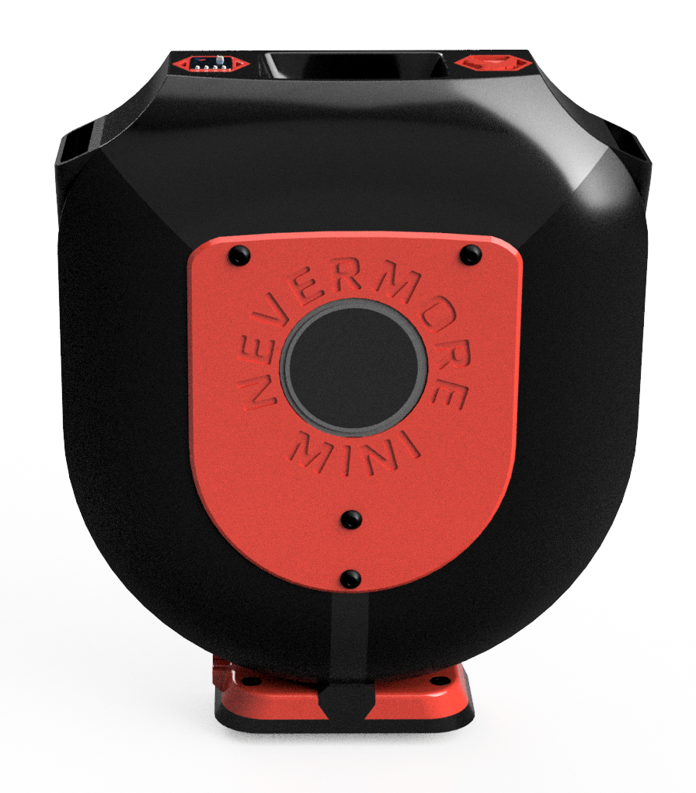
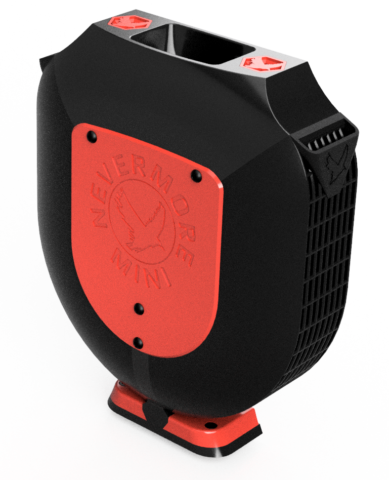
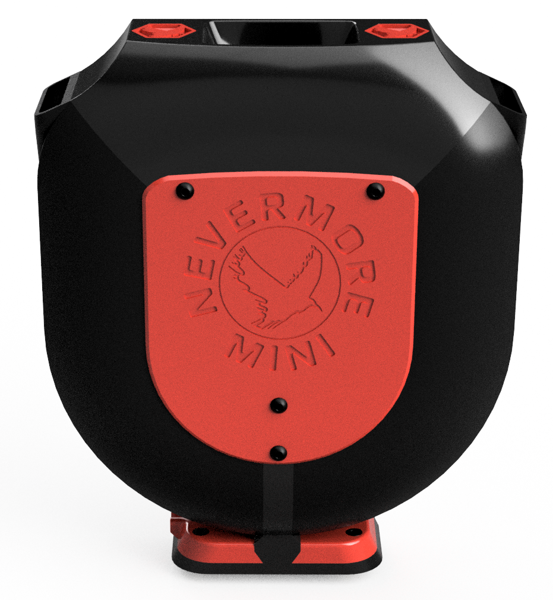

Mini size - Max performance. A new standard in tiny printer filtration. Read more on [Printables](https://www.printables.com/model/757663-nevermore-mini-3d-printer-hepa-and-carbon-air-filt), which will have the most up to date information. Github is mainly to reach the CAD files and raise issues, finding our , or [Nevermore Filtration Media](https://github.com/nevermore3d/Reseller). 

Same performance as 3-6 micros, plus hepa filtration, in an adaptable package. Use with a single fan controlled by the printer, as standalone or as a connected mcu with VOC sensors? Mini got you covered. 

Beta release 155(W)x187(H)x48(D) mm, but will come in several sizes. January 2024.

